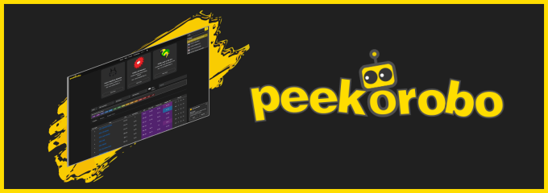
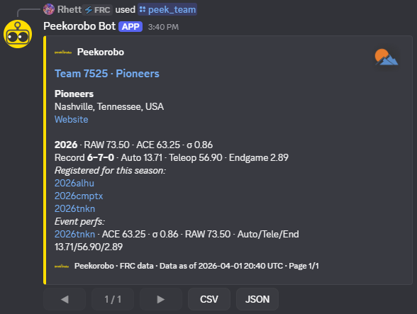
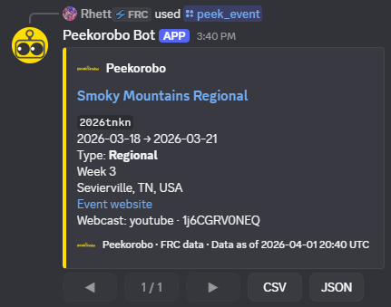
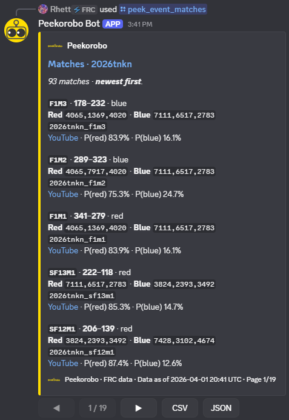

# Peekorobo Discord bot

---

**FRC data in Discord** — slash commands backed by the [Peekorobo API](https://www.peekorobo.com): teams, events, ACE/RAW, rankings, matches, awards, and exports. Built for scouts, mentors, and anyone who lives in match threads.

---

## Screenshots

---

## Setup

### API keys

Users run **`/peek_auth`** once and paste their own Peekorobo API key. **`/peek_auth_clear`** removes it. No shared key is required for other users.

---

## Commands

| Command | What it does |
|---------|----------------|
| `/peek` · `/peek_help` | Command list |
| `/peek_auth` · `/peek_auth_clear` | Save or remove your API key |
| `/peek_ping` | Test API + your key |
| `/peek_team` | Team profile, season stats, events, perfs |
| `/peek_teams` | Search teams by season + filters |
| `/peek_event` | One event’s info |
| `/peek_events` · `/peek_event_keys` | Season events or raw keys |
| `/peek_rankings` | Event rankings |
| `/peek_event_teams` | Registered teams at an event |
| `/peek_event_matches` | Matches (newest first; optional team filter) |
| `/peek_event_awards` · `/peek_event_perfs` | Awards & per-team metrics at an event |
| `/peek_team_awards` · `/peek_team_events` | Team awards & event history |

Long replies paginate with **◀ / ▶**; CSV/JSON export buttons where shown. Only the invoker can use the buttons.

---

## License

See `LICENSE` in this repository.
